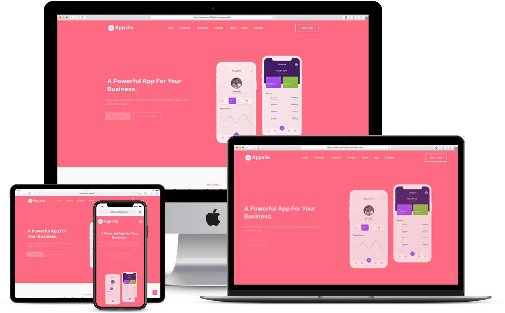

# Appvila Website

AppVilla is a free and premium app Landing Page Template for App, Software, and SaaS Websites. This stunning landing page is created by the latest version of the popular framework Bootstrap 5. AppVilla comes with 7+ different essential pages such as contact, blog pages, pricing plans, etc.

If you are looking for a creative app landing page with cool design, all essential pages & elements AppVilla is just perfect choice.

## Project Specifications:

This versatile website has a simple, colorful, and high-quality design that easily attracts the viewer's eye. Appvila can adapt to any kind of screen or device that is one of the most demanding features nowadays. So, this mobile-friendly template is fully responsive and can customize easily according to the latest trend or your choice.

 
## Steps to execute this App:
- Download the entire code 
- Open up the index.html.
- [View Live Site](https://anthonys1760.github.io/app-villa/)

## Technologies used: 
- HTML
- CSS
- Javascript
